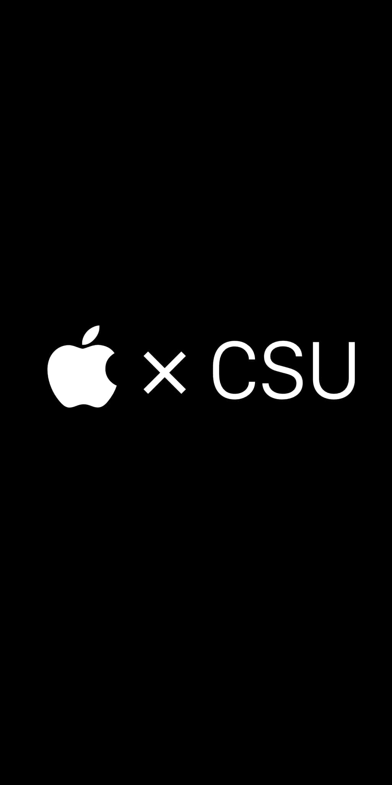

footer: ZHENG HAOTIAN @ CSU Apple Lab, 2016.11
slidenumbers: true
autoscale: true

# [fit] iOS App Development

--- 

# Chapter 1
## Get Started

--- 

# 1.1 Basic Knowledge
**Things about :**  

- 🤗 Me 
- 🕹 The CSU Apple Lab 
- 📱 The iOS App Dev Class 

--- 
# 🤗 About Me
郑昊天，计科 1402  

iOS / Unity App Development since 2015  
Basic UI Design Skill

**GitHub** : [@JustinFincher](https://github.com/JustinFincher)
**Dribbble** : [@JustZht](https://dribbble.com/JustZht)
**Website** : [justzht.com](http://www.justzht.com/) or [fincher.im](https://fincher.im/)

--- 
# 🕹 The CSU Apple Lab
  

**Location** : 
中南大学新校区电子电工实验中心 401  

**GitHub Organization** : 
[@CSU-Apple-Lab](https://github.com/CSU-Apple-Lab)

---
# 📱 The iOS App Dev Class
**教学对象**：
有一定语言基础，但没有编写过 [^GUI] 软件的同学  

**教学目的**：
1.了解 iOS 软件结构，编写能够请求网络，解析／储存数据的 iOS App  
2.学会如何使用 Google ／ StackOverflow 独立解决问题  
3.学会使用 iOS 软件开发工具链

[^GUI]: [Graphical User Interface](https://www.google.co.jp/url?sa=t&rct=j&q=&esrc=s&source=web&cd=2&cad=rja&uact=8&ved=0ahUKEwjBjs-giPfPAhWCiFQKHQOHBY8QFgggMAE&url=https%3A%2F%2Fzh.wikipedia.org%2Fzh-hans%2F%25E5%259B%25BE%25E5%25BD%25A2%25E7%2594%25A8%25E6%2588%25B7%25E7%2595%258C%25E9%259D%25A2&usg=AFQjCNEoD1obp9q-A6nbYv8RAM5dgl-4Tg). 图形用户界面，简称 GUI

---
# 📱 The iOS App Dev Class
**教学目的**：
4.基本的 HIG 认知  

**教学时长**：
每周一次，约 10 周。

---
# 1.2 Course Arrangement 
**1.Get Started**
基础介绍，了解 Mac 系统（如有需），注册开发者账户，了解 Xcode 界面，运行第一个程序

**2.Basic**
